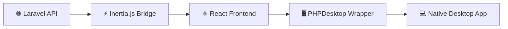
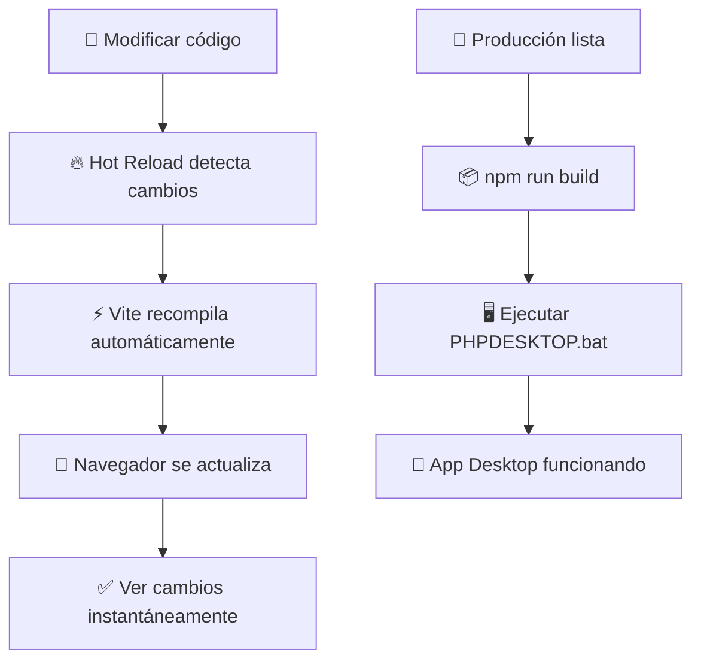

# 🚀 Laravel + React + PHPDesktop App

<div align="center">


### 💻 **Aplicación de Escritorio Moderna** 
### 🌐 **Tecnologías Web → Experiencia Nativa**

</div>

---

## 🎯 **¿Qué es esto?**

> **Una aplicación de escritorio** construida con Laravel y React que funciona **nativamente** en Windows, macOS y Linux usando PHPDesktop como wrapper.



---

## 🛠️ **Stack Tecnológico**

<table>
<tr>
<td align="center" width="25%">

### ⚡ **Laravel**
Framework PHP robusto
- Eloquent ORM
- Arquitectura MVC
- API Routes

</td>
<td align="center" width="25%">

### ⚛️ **React**
UI Library moderna
- Components
- Hooks
- TypeScript

</td>
<td align="center" width="25%">

### 🔗 **Inertia.js**
Puente sin APIs
- Server-side routing
- Client-side rendering
- SPA Experience

</td>
<td align="center" width="25%">

### 🖥️ **PHPDesktop**
Desktop Wrapper
- Cross-platform
- Native feel
- Web technologies

</td>
</tr>
</table>

---

## ⚡ **Instalación Rápida**

### 📋 **Prerrequisitos**

```bash
✅ PHP 8.3+
✅ Composer
✅ Node.js 18+
✅ NPM/Yarn
```

### 🔧 **Paso 1: Configurar Laravel**

```bash
# 📥 Clonar proyecto
git clone https://github.com/tu-usuario/laravel-desktop-app.git
cd laravel-desktop-app

# 📦 Instalar dependencias PHP
composer install

# ⚙️ Configurar entorno
cp .env.example .env
php artisan key:generate

# 🔧 Configurar permisos (Linux/macOS)
chmod -R 775 storage bootstrap/cache
```

### 🎨 **Paso 2: Configurar Frontend**

```bash
# 📦 Instalar dependencias Node
npm install

# 🛠️ Construir assets
npm run build

# 🔥 Para desarrollo (Hot Reload)
npm run dev
```

### 🖥️ **Paso 3: Configurar PHPDesktop**

<details>
<summary><b>📁 Estructura de PHPDesktop</b></summary>

```
phpdesktop-chrome-130.1-php-8.3/
├── 📄 phpdesktop-chrome.exe
├── 📄 settings.json
├── 📁 php/
│   ├── 📄 php.exe
│   └── 📄 php.ini
└── 📁 www/
    └── 📁 ejemplo-app/ (tu proyecto Laravel)
```

</details>

#### 🔧 **Configurar `settings.json`**

```json
{
    "application": {
        "main_url": "http://127.0.0.1:54007/",
        "width": 1200,
        "height": 800,
        "min_width": 800,
        "min_height": 600
    },
    "web_server": {
        "listen_on": ["127.0.0.1", 54007],
        "www_directory": "./www/ejemplo-app/public/"
    }
}
```

#### ⚙️ **Configurar `php.ini`**

```ini
; 🔧 Extensiones necesarias
extension=php_gd.dll
extension=php_mbstring.dll
extension=php_openssl.dll
extension=php_pdo_mysql.dll

; 📝 Configuraciones recomendadas
max_execution_time = 300
memory_limit = 256M
post_max_size = 64M
upload_max_filesize = 64M
```

---

## 🚀 **Scripts de Automatización**

### 💻 **DESARROLLO.bat** - *Modo Hot Reload*

```batch
@echo off
title DESARROLLO WEB - Laravel + React + Hot Reload

echo [1/4] Cerrando procesos anteriores...
taskkill /F /IM php.exe >nul 2>&1
taskkill /F /IM node.exe >nul 2>&1

echo [2/4] Limpiando cache de Laravel...
php artisan cache:clear >nul 2>&1
php artisan config:clear >nul 2>&1

echo [3/4] Iniciando servidores de desarrollo...
start /MIN "Vite-HotReload" cmd /c "npm run dev"
start /MIN "Laravel-Server" cmd /c "php artisan serve --port=8888"

echo [4/4] Abriendo navegador web...
start http://127.0.0.1:8888
```

### 🖥️ **PHPDESKTOP.bat** - *App de Escritorio*

```batch
@echo off
title Mi App Laravel Desktop

echo [1/5] Cerrando procesos anteriores...
taskkill /F /IM phpdesktop-chrome.exe >nul 2>&1
taskkill /F /IM php.exe >nul 2>&1

echo [2/5] Preparando Laravel...
php artisan cache:clear >nul 2>&1
php artisan config:clear >nul 2>&1

echo [3/5] Construyendo aplicación...
npm run build

echo [4/5] Iniciando servidor Laravel...
start /MIN /B "Laravel Server" php artisan serve --port=8888

echo [5/5] Abriendo aplicación de escritorio...
cd /d "C:\...\phpdesktop-chrome-130.1-php-8.3"
start "" phpdesktop-chrome.exe
```

---

## 🔄 **Flujo de Desarrollo**



---

## 📁 **Estructura del Proyecto**

<details>
<summary><b>🗂️ Ver estructura completa</b></summary>

```
proyecto/
├── 📂 app/
│   ├── 📂 Http/Controllers/     # Controladores Laravel
│   └── 📂 Models/               # Modelos Eloquent
├── 📂 resources/
│   ├── 📂 js/
│   │   ├── 📄 app.tsx          # Entrada principal React
│   │   ├── 📂 pages/           # Páginas Inertia
│   │   └── 📂 components/      # Componentes React
│   └── 📂 css/
│       └── 📄 app.css          # Estilos Tailwind
├── 📂 routes/
│   └── 📄 web.php              # Rutas de la aplicación
├── 📂 public/
│   ├── 📄 index.php            # Entrada PHP
│   └── 📂 build/               # Assets compilados
├── 📄 package.json             # Dependencias Node
├── 📄 composer.json            # Dependencias PHP
├── 📄 vite.config.ts           # Configuración Vite
└── 📄 tailwind.config.js       # Configuración Tailwind
```

</details>

---

## ⚙️ **Configuraciones Clave**

### 🔧 **vite.config.ts**

```typescript
import { defineConfig } from 'vite';
import laravel from 'laravel-vite-plugin';
import react from '@vitejs/plugin-react';

export default defineConfig({
    plugins: [
        laravel({
            input: 'resources/js/app.tsx',
            refresh: true,
        }),
        react(),
    ],
    server: {
        host: '0.0.0.0',
        port: 5173,
        hmr: {
            host: 'localhost',
        },
    },
});
```

### 🎨 **tailwind.config.js**

```javascript
export default {
    content: [
        './resources/**/*.blade.php',
        './resources/**/*.js',
        './resources/**/*.tsx',
    ],
    theme: {
        extend: {
            colors: {
                primary: '#8B5CF6',
                secondary: '#06B6D4',
            }
        },
    },
    plugins: [],
}
```

---

## 🔗 **Integración Laravel + Inertia + React**

### 🛣️ **routes/web.php**

```php
<?php

use Inertia\Inertia;

Route::get('/', function () {
    return Inertia::render('Welcome', [
        'appInfo' => [
            'name' => config('app.name'),
            'version' => '1.0.0',
            'environment' => app()->environment(),
        ]
    ]);
});
```

### ⚛️ **resources/js/app.tsx**

```typescript
import { createInertiaApp } from '@inertiajs/react';
import { createRoot } from 'react-dom/client';

createInertiaApp({
    resolve: (name) => {
        const pages = import.meta.glob('./pages/**/*.tsx', { eager: true });
        return pages[`./pages/${name}.tsx`];
    },
    setup({ el, App, props }) {
        createRoot(el).render(<App {...props} />);
    },
});
```

---

## 🐛 **Solución de Problemas**

<details>
<summary><b>❌ Error: PHPDesktop no inicia</b></summary>

**Solución:**
1. Verificar que `php.ini` tenga las extensiones correctas
2. Comprobar que Laravel esté en el puerto correcto
3. Revisar permisos de archivos

```bash
# Verificar extensiones PHP
php -m | findstr gd
php -m | findstr mbstring
```

</details>

<details>
<summary><b>❌ Error: Hot Reload no funciona</b></summary>

**Solución:**
1. Verificar que Vite esté corriendo en puerto 5173
2. Comprobar configuración de firewall
3. Reiniciar servidores

```bash
# Verificar puertos activos
netstat -an | findstr :5173
netstat -an | findstr :8888
```

</details>

<details>
<summary><b>❌ Error: Páginas en blanco</b></summary>

**Solución:**
1. Verificar que los assets estén compilados
2. Limpiar cache de Laravel
3. Revisar rutas de Inertia

```bash
npm run build
php artisan cache:clear
php artisan config:clear
```

</details>

---

## 📊 **Rendimiento y Optimización**

### ⚡ **Modo Desarrollo**
- 🔥 **Hot Reload** activado
- 🐛 **Source Maps** habilitados  
- 📝 **Logging** detallado

### 🚀 **Modo Producción**
- 📦 **Assets minificados**
- 🗜️ **Gzip compression**
- ⚡ **Cache optimizado**

```bash
# Optimización para producción
npm run build
php artisan config:cache
php artisan route:cache
php artisan view:cache
```

---

## 🎯 **Próximos Pasos**

- [ ] 📱 Añadir notificaciones del sistema
- [ ] 🔐 Implementar autenticación
- [ ] 💾 Agregar base de datos local
- [ ] 🔄 Sistema de actualizaciones automáticas
- [ ] 📊 Analytics de uso
- [ ] 🌙 Modo oscuro/claro

---

## 🤝 **Contribuir**

1. 🍴 Fork el proyecto
2. 🔧 Crea tu feature branch (`git checkout -b feature/AmazingFeature`)
3. 💾 Commit tus cambios (`git commit -m 'Add some AmazingFeature'`)
4. 📤 Push to the branch (`git push origin feature/AmazingFeature`)
5. 🔄 Abre un Pull Request

---

## 📄 **Licencia**

Este proyecto está bajo la Licencia MIT. Ver `LICENSE` para más detalles.

---

<div align="center">

### 🚀 **¡Tu app de escritorio está lista!**

**Hecho con ❤️ usando el stack NativePHP**


</div>
